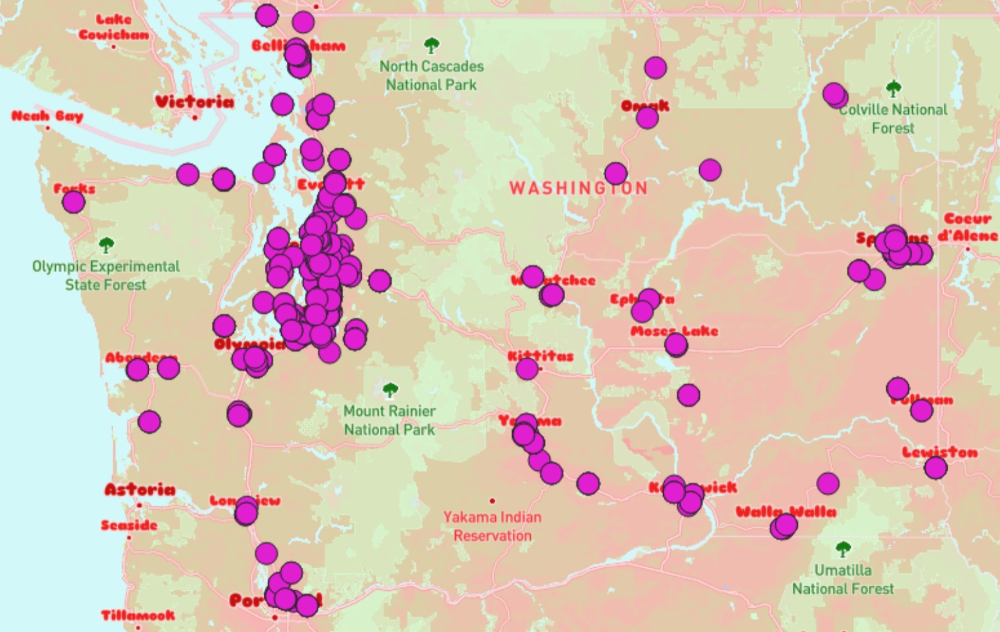

# Geog 458 Lab 4: Making tiles and Mapbox

### Introduction
We have displayed four different tilesets on a webmap 
using Mapbox Studio, Mapbox GL JS, QGIS, and QMetaTiles.

The examined geographic area is Washington State,
and our thematic layer is nursing home locations in the state.

The available zoom levels of each tileset are set from 1-8 in QGIS and QMetaTiles.

**URL to access the webmap:** https://aaron-thai.github.io/tilelab/

### The tilesets

This section will have screenshots of the four layers and brief descriptions of each tileset.

 
*bubble: A modified version of the Bubblegum basemap from Mapbox Studio. Some fonts and colors are changed.*

 
*nursing homes: Dot density map of nursing home locations in Washington State. Data is from the [Washington Open Geospatial Data Portal](https://aaron-thai.github.io/uscovid2020/map1.html).*

 
*combined: The bubble layer and nursing home layer together on one map tile layer*

 
*rosemary: A custom rosemary themed basemap made with Mapbox Cartogram, with additional icons for States.*